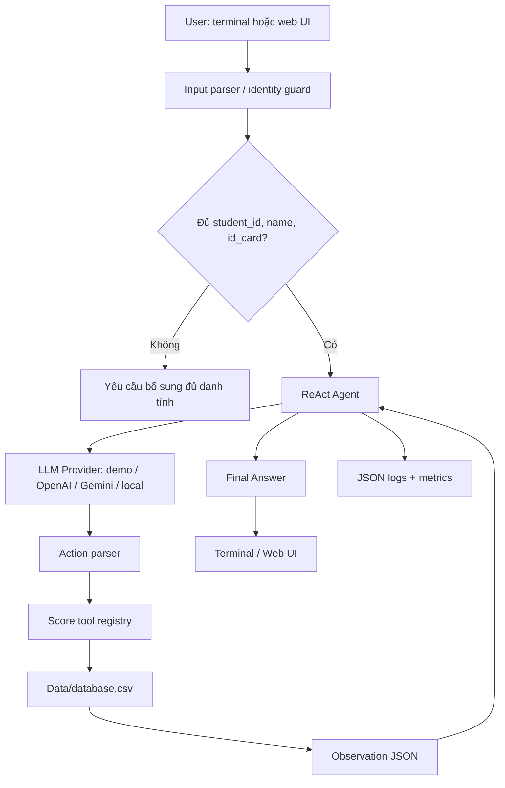

# Báo cáo nhóm 24 - Lab 3: Chatbot vs ReAct Agent

- **Nhóm**: 24
- **Thành viên**:
  - Lê Quốc Anh - 2A202600824
  - Nguyễn Đức Khang - 2A202600588
  - Nguyễn Đức Mạnh - 2A202600945
  - Lý Hải Long - 2A202600568
- **Chủ đề**: So sánh chatbot baseline với ReAct Agent có tool, dataset, logging, terminal chat và web UI.
- **Repository**: `Day-3-Lab-Chatbot-vs-react-agent`

---

## 1. Tóm tắt dự án

Nhóm 24 xây dựng một hệ thống tư vấn học tập nhỏ dựa trên dữ liệu điểm trong `Data/database.csv`. Hệ thống có hai cách trả lời:

1. **Baseline chatbot**: trích xuất định danh sinh viên từ câu hỏi và gọi trực tiếp hàm phân loại học lực.
2. **ReAct Agent**: dùng vòng lặp `Thought -> Action -> Observation -> Final Answer`, gọi các tool Python để xác thực sinh viên, lấy điểm, tính trung bình và phân loại học lực.

Phiên bản hiện tại không chỉ có script demo mà còn có:

- dataset CSV gồm 100 sinh viên;
- score tools deterministic;
- provider abstraction cho `demo`, `openai`, `gemini`, `local`;
- terminal chat qua `scripts/chat_agent.py`;
- web UI qua `scripts/run_web_ui.py` và thư mục `web/`;
- logging JSON trong `logs/`;
- evaluation artifacts trong `evaluation/`;
- test suite với kết quả hiện tại: `25 passed`.

Mục tiêu chính của nhóm không phải chỉ tạo một chatbot trả lời nghe tự nhiên. Mục tiêu là tạo một agent có thể kiểm chứng: mỗi câu trả lời về điểm hoặc học lực phải truy vết được về dữ liệu và tool observation.

---

## 2. Phân công công việc

| Thành viên | Phần phụ trách chính | File/nhóm file liên quan |
| --- | --- | --- |
| Nguyễn Đức Mạnh | Dataset, parse điểm, score tools, policy học lực | `Data/database.csv`, `src/tools/score_tools.py`, `tests/test_score_tools.py` |
| Nguyễn Đức Khang | ReAct loop, action parser, identity validation guard, provider flow | `src/agent/agent.py`, `src/demo_provider.py`, `tests/test_agent.py` |
| Lê Quốc Anh | Baseline chatbot, evaluation cases, so sánh baseline vs agent | `src/chatbot.py`, `scripts/run_baseline.py`, `scripts/run_evaluation.py`, `evaluation/` |
| Lý Hải Long | Demo offline, logging/telemetry, terminal chat, web UI, tài liệu chạy thử | `src/demo_provider.py`, `src/telemetry/`, `scripts/chat_agent.py`, `scripts/run_web_ui.py`, `web/`, `README.md` |

Các phần có giao nhau, nhưng cách chia trên giúp mỗi người có một vùng trách nhiệm rõ ràng. Dataset và tool là nền; agent quyết định gọi tool; baseline và evaluation giúp so sánh; CLI/web UI giúp người dùng thao tác thực tế.

---

## 3. Dataset và phạm vi dữ liệu

Dataset chính nằm tại:

```text
Data/database.csv
```

File có 100 dòng sinh viên và các cột:

```text
ID
Name
ID_Card
Computer Science
Microeconomics
Data Structures and Algorithms
Calculus
Linear Algebra
```

Một số điểm đáng chú ý:

- CSV dùng dấu `;` làm delimiter.
- Điểm dùng dấu phẩy làm phần thập phân, ví dụ `9,30`.
- Tool phải chuyển `9,30` thành `9.30` trước khi tính toán.
- Dataset không có cột học kỳ, trạng thái sinh viên hoặc lớp.
- Trong lab, dataset được xem như một snapshot điểm giả lập, không phải dữ liệu thật của trường.

Ví dụ record:

```text
30;Royce Lowe;822067;9,30;8,59;6,87;7,35;9,85
38;Jair Ball;505496;9,73;6,30;8,89;9,02;9,15
```

---

## 4. Chính sách học lực

Hệ thống dùng thang điểm 10. Một môn được xem là qua nếu:

```text
score >= 4.0
```

Phân loại học lực theo điểm trung bình:

| Loại | Điều kiện |
| --- | --- |
| Xuất sắc | `average_score >= 9.0` |
| Giỏi | `8.0 <= average_score < 9.0` |
| Khá | `6.5 <= average_score < 8.0` |
| Trung bình | `5.0 <= average_score < 6.5` |
| Yếu | `average_score < 5.0` |

Điều kiện bổ sung:

```text
Muốn được xếp loại Khá trở lên, sinh viên phải qua tất cả các môn.
```

Vì vậy tool không chỉ tính average. Nó còn trả `failed_courses` và `passed_all_courses` để agent không bỏ sót trường hợp sinh viên có điểm trung bình ổn nhưng có môn dưới 4.0.

---

## 5. Kiến trúc hệ thống



Các thành phần chính:

```text
src/chatbot.py                  # baseline chatbot
src/agent/agent.py              # ReAct loop và identity guard
src/demo_provider.py            # deterministic provider cho demo offline
src/tools/score_tools.py        # score tools và policy
src/core/*.py                   # OpenAI, Gemini, local provider
src/telemetry/*.py              # logging và metric
scripts/chat_agent.py           # terminal chat
scripts/run_web_ui.py           # local web server
web/index.html                  # giao diện chat
web/styles.css                  # giao diện responsive
web/app.js                      # gọi API /api/chat
scripts/run_evaluation.py       # benchmark runner
```

---

## 6. Baseline chatbot

Baseline nằm trong `src/chatbot.py`. Nó không có ReAct loop. Cách hoạt động:

```text
User query -> extract identifier -> categorize_academic_performance -> answer
```

Ưu điểm:

- đơn giản;
- dễ chạy;
- phù hợp làm mốc so sánh;
- pass được các case cơ bản khi query rõ ràng.

Hạn chế:

- không có trace;
- không giải thích được nó đã gọi bước nào;
- không phù hợp nếu yêu cầu audit từng quyết định;
- dễ khó debug khi input mơ hồ.

Baseline giúp nhóm trả lời câu hỏi: “Nếu không dùng ReAct, hệ thống đã đủ chưa?”. Với bài toán có dữ liệu rõ, baseline có thể trả lời được, nhưng ReAct Agent tốt hơn ở tính truy vết và khả năng mở rộng tool.

---

## 7. ReAct Agent

Agent nằm trong `src/agent/agent.py`. Vòng lặp chính:

```text
Thought -> Action -> Observation -> Final Answer
```

Agent có các nhiệm vụ:

1. nhận câu hỏi người dùng;
2. kiểm tra có đủ định danh sinh viên hay không;
3. gửi prompt cho provider;
4. parse `Action: tool_name(args)`;
5. gọi đúng Python tool;
6. đưa observation quay lại prompt;
7. dừng khi có `Final Answer`;
8. ghi log từng bước.

Điểm cải tiến quan trọng trong bản hiện tại là **identity guard**. Với thông tin sinh viên, agent không được trả điểm nếu thiếu một trong ba trường:

```text
student_id
name
id_card
```

Agent chấp nhận nhiều cách nhập, miễn là đủ ba dữ liệu:

```text
student_id 30 name Royce Lowe id_card 822067
30 Royce Lowe 822067
38;Jair Ball;505496
Cho tôi điểm của sinh viên Royce Lowe, mã sinh viên 30, số CCCD 822067
```

Nếu thiếu dữ liệu:

```text
điểm của 822067
```

Agent trả:

```text
Vui lòng cung cấp đủ student_id, name và id_card trước khi xem thông tin sinh viên.
```

Thiết kế này làm hệ thống chặt hơn so với chỉ dùng một identifier.

---

## 8. Tool inventory

### `validate_student(student_id, name, id_card)`

Xác thực sinh viên bằng cả ba trường. Tool chỉ trả `found: true` nếu `ID`, `Name`, `ID_Card` cùng khớp một record.

Ví dụ đúng:

```python
validate_student(30, "Royce Lowe", "822067")
```

Ví dụ sai:

```text
31 Abby Pruitt 432848
```

Trong dataset, Abby Pruitt có `ID=35`, nên tool trả mismatch ở `student_id`. Đây là hành vi mong muốn vì hệ thống không được tự sửa sai danh tính.

### `get_student_marks(identifier)`

Trả toàn bộ điểm các môn của sinh viên sau khi đã xác thực.

### `calculate_average_score(identifier)`

Tính điểm trung bình, danh sách môn trượt và `passed_all_courses`.

### `grade_policy_lookup()`

Trả policy học lực để agent có thể giải thích quy tắc nếu cần.

### `categorize_academic_performance(identifier)`

Tool tổng hợp cho học lực:

```text
student
average_score
failed_courses
passed_all_courses
base_category
category
policy
```

### Tool phân tích lớp

Repo còn có:

```text
list_courses()
get_course_summary(course_name)
get_low_score_students(course_name, threshold)
compare_courses()
```

Các tool này giúp mở rộng từ câu hỏi theo sinh viên sang câu hỏi theo môn hoặc toàn lớp.

---

## 9. Terminal chat và Web UI

### Terminal chat

Chạy:

```bash
.venv/bin/python scripts/chat_agent.py --provider demo
```

Hoặc với API:

```bash
.venv/bin/python scripts/chat_agent.py --provider openai --model gpt-4o
```

Terminal chat hỗ trợ luồng bổ sung danh tính. Nếu user hỏi:

```text
đưa ra điểm
```

Agent yêu cầu đủ định danh. User có thể nhập dòng tiếp theo:

```text
10 Axl Waters 876012
```

CLI sẽ ghép với câu hỏi trước để gọi agent.

### Web UI

Chạy:

```bash
.venv/bin/python scripts/run_web_ui.py
```

Mở:

```text
http://127.0.0.1:8000
```

Nếu port 8000 bận, server tự chọn port tiếp theo và in URL mới.

Web UI có:

- panel chọn provider;
- input model;
- max steps;
- local model path;
- khung chat;
- quick prompts;
- API `/api/chat`;
- API `/api/health`;
- lưu context một lượt khi user cần bổ sung danh tính.

Web UI giúp lab dễ kiểm thử hơn vì người chấm không cần nhớ lệnh terminal hoặc format prompt dài.

---

## 10. Provider strategy

Repo hỗ trợ nhiều provider qua interface `LLMProvider`:

```text
DemoAcademicProvider
OpenAIProvider
GeminiProvider
LocalProvider
```

`DemoAcademicProvider` được dùng trong test và demo offline. Nó deterministic, không cần API key, nhưng vẫn trả output theo format ReAct để agent thật sự parse action và gọi tool.

OpenAI/Gemini/local dùng cho thử nghiệm thật. Cách tách provider giúp hệ thống không bị khóa vào một model cụ thể.

---

## 11. Logging và telemetry

Logger ghi event JSON vào `logs/YYYY-MM-DD.log`. Các event chính:

```text
AGENT_START
IDENTITY_REQUIRED
LLM_METRIC
LLM_RESPONSE
TOOL_CALL
PARSER_ERROR
FINAL_ANSWER
AGENT_END
```

Metric có:

```text
provider
model
prompt_tokens
completion_tokens
total_tokens
latency_ms
cost_estimate
```

Log giúp nhóm debug các lỗi như:

- model trả lời tự nhiên thay vì `Action`;
- parser không nhận input tiếng Việt;
- validate sai do mismatch;
- agent vượt `max_steps`;
- tool trả `found: false`.

---

## 12. Evaluation

Chạy:

```bash
.venv/bin/python scripts/run_evaluation.py
```

Artifact:

```text
evaluation/results.json
evaluation/summary.md
```

Benchmark gồm bốn nhóm case:

| Case | Mục tiêu |
| --- | --- |
| Royce Lowe / 822067 | Sinh viên học lực Giỏi |
| Emmanuel Myers / 107226 | Sinh viên học lực Khá |
| Axl Waters / 876012 | Sinh viên có môn trượt |
| Invalid student / 999999 | Không được bịa dữ liệu |

Kết quả kiểm thử hiện tại:

```text
25 passed
```

Số test tăng so với bản đầu vì repo đã bổ sung test cho:

- identity guard;
- input tiếng Việt;
- input không theo thứ tự;
- input dạng CSV `ID;Name;ID_Card`;
- web/CLI flow liên quan danh tính;
- mismatch message.

---

## 13. Các lỗi chính đã xử lý

### Decimal comma

CSV dùng `9,30`, Python cần `9.30`. Tool xử lý bằng cách thay `,` thành `.` trước khi ép `float`.

### Validate một trường chưa đủ an toàn

Thiết kế đầu dùng một identifier. Bản mới yêu cầu đủ `student_id`, `name`, `id_card`.

### Input tiếng Việt linh hoạt

User có thể viết:

```text
Cho tôi điểm của sinh viên Royce Lowe, mã sinh viên 30, số CCCD 822067
```

Parser cần hiểu đủ ba trường dù thứ tự không cố định.

### Port web UI bị chiếm

Khi port 8000 đã có server chạy, script cũ bị:

```text
OSError: Address already in use
```

Bản mới tự thử các port tiếp theo và in URL thực tế.

### Agent loop lặp khi model trả lời tự nhiên

Nếu model không trả `Action` hoặc `Final Answer`, agent không nên gọi API nhiều lần vô ích. Bản mới có đường direct response để tránh vòng lặp lỗi parser trong các câu hỏi thiếu thông tin.

---

## 14. Cách chạy lại

Setup:

```bash
python3 -m venv .venv
. .venv/bin/activate
pip install -r requirements.txt
```

Test:

```bash
.venv/bin/python -m pytest -q
```

Baseline:

```bash
.venv/bin/python scripts/run_baseline.py
```

Demo agent:

```bash
.venv/bin/python scripts/run_demo_agent.py
```

Terminal chat:

```bash
.venv/bin/python scripts/chat_agent.py --provider demo
```

Web UI:

```bash
.venv/bin/python scripts/run_web_ui.py
```

Evaluation:

```bash
.venv/bin/python scripts/run_evaluation.py
```

---

## 15. Hạn chế

Các hạn chế còn lại:

- dataset chưa có học kỳ;
- dataset chưa có trạng thái sinh viên;
- chưa có authentication cho web UI;
- action parser vẫn dựa trên text/regex, chưa dùng structured tool calling;
- cost estimate đang là mock;
- web UI là local demo, chưa phải production deployment;
- chưa có masking thông tin định danh trong log.

---

## 16. Hướng phát triển

Nếu phát triển tiếp, nhóm ưu tiên:

1. Chuyển action parser sang JSON schema hoặc tool calling native.
2. Thêm upload dataset hoặc chọn dataset từ UI.
3. Bổ sung semester/status trong dữ liệu.
4. Thêm dashboard cho latency, token usage, parser error rate.
5. Thêm authentication nếu web UI dùng ngoài máy local.
6. Mask ID card trong production logs.
7. Tách API server thành FastAPI nếu cần deploy thật.

---

## 17. Kết luận

Nhóm 24 đã hoàn thiện một hệ thống lab có đủ ba lớp: dữ liệu và tool deterministic, agent có trace, và giao diện người dùng qua terminal/web. Baseline giúp nhóm có mốc so sánh, còn ReAct Agent cho thấy lợi ích của việc tách suy luận và hành động. Điểm cải thiện lớn nhất của bản cuối là hệ thống không chỉ chạy demo một case, mà có thể nhận input linh hoạt, xác thực đủ ba trường định danh, ghi log, kiểm thử tự động và thao tác qua web UI.
