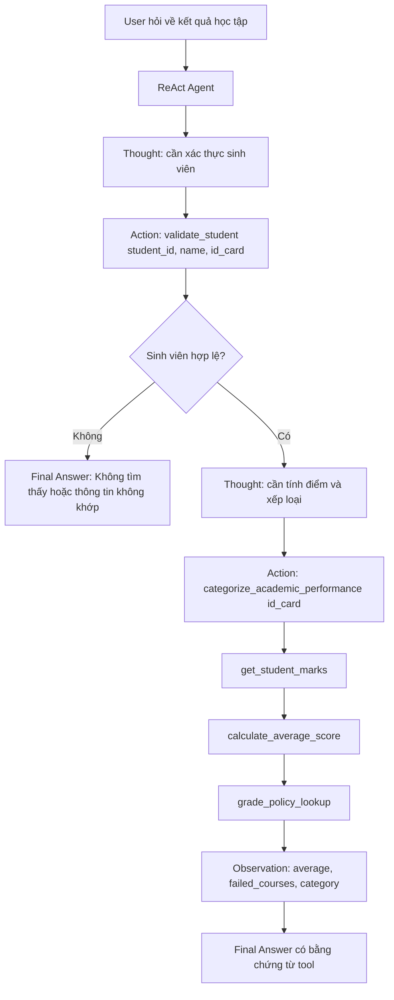

# Báo cáo nhóm - Lab 3: Chatbot vs ReAct Agent

- **Nhóm**: 24
- **Thành viên**:
  - Lê Quốc Anh - 2A202600824
  - Nguyễn Đức Khang - 2A202600588
  - Nguyễn Đức Mạnh - 2A202600945
  - Lý Hải Long - 2A202600568
- **Chủ đề lab**: So sánh chatbot thông thường với ReAct Agent có tool, trace và logging.

---

## 1. Tóm tắt hệ thống

Nhóm F2 xây dựng một agent tư vấn học tập nhỏ. Agent đọc dữ liệu điểm từ `Data/database.csv`, xác thực sinh viên, lấy điểm các môn, tính điểm trung bình theo thang 10 và phân loại học lực theo chính sách đã định nghĩa trong code.

Dataset hiện có các cột:

```text
ID
Name
ID_Card
Computer Science
Microeconomics
Data Structures and Algorithms
Calculus
Linear Algebra
```

Mỗi dòng là một sinh viên. Mỗi cột môn học là điểm trên thang 10. File CSV dùng dấu chấm phẩy `;` làm delimiter và dùng dấu phẩy cho số thập phân, ví dụ `9,30`. Vì vậy tool phải parse `9,30` thành `9.30` trước khi tính toán.

Hệ thống có hai hướng trả lời:

- **Baseline chatbot**: lấy identifier từ câu hỏi và trả kết quả trực tiếp bằng một hàm tổng hợp.
- **ReAct Agent**: chia bài toán thành các bước `Thought → Action → Observation → Final Answer`, gọi tool và ghi log từng bước.

Điểm khác biệt chính là ReAct Agent có trace. Khi câu trả lời sai, nhóm có thể xem agent đã gọi tool nào, tool trả gì và lỗi nằm ở parser, tool hay policy.

---

## 2. Data provenance

Dữ liệu trong báo cáo này đến từ file:

```text
Data/database.csv
```

Đây là dataset dùng cho lab/demo, không phải dữ liệu sinh viên thật của trường. Trong báo cáo, các tên như `Royce Lowe`, `Emmanuel Myers`, `Axl Waters` được dùng như record trong dataset để kiểm thử agent.

Dataset không có cột `semester` hoặc `status`. Vì vậy hệ thống không tự tạo thông tin như “Spring 2026” hoặc “Đang học”. Khi cần nói về học kỳ, báo cáo chỉ xem file CSV là một snapshot điểm cho một kỳ học giả lập của lab.

---

## 3. Kiến trúc

Các thành phần chính:

```text
User Query
   ↓
Baseline Chatbot hoặc ReAct Agent
   ↓
Score Tools
   ↓
Data/database.csv
   ↓
Final Answer + Logs + Evaluation Artifacts
```

File chính trong repo:

```text
src/chatbot.py
src/agent/agent.py
src/demo_provider.py
src/tools/score_tools.py
src/telemetry/logger.py
src/telemetry/metrics.py
scripts/run_baseline.py
scripts/run_demo_agent.py
scripts/run_evaluation.py
evaluation/results.json
evaluation/summary.md
```

Vai trò từng phần:

- `src/chatbot.py`: baseline đơn giản để so sánh với agent.
- `src/agent/agent.py`: ReAct loop, parse action, gọi tool, ghi observation và dừng khi có final answer.
- `src/tools/score_tools.py`: xử lý dữ liệu điểm, tính toán và phân loại học lực.
- `src/demo_provider.py`: provider deterministic để chạy demo offline, không cần API key.
- `scripts/run_evaluation.py`: chạy benchmark cases và sinh artifact trong thư mục `evaluation/`.
- `src/telemetry/logger.py`: ghi JSON event logs cho agent và tool calls.

---

## 4. Flowchart xử lý




Luồng này tách phần “suy luận” và phần “tính toán” rõ ràng:

- Agent quyết định bước tiếp theo.
- Tool thực hiện tính toán deterministic.
- Final answer chỉ tổng hợp lại observation từ tool.

---

## 5. Tool inventory

### 5.1 `validate_student(student_id, name, id_card)`

Mục đích: xác thực sinh viên bằng cả ba trường định danh:

```text
internal ID
exact full name
ID card
```

Ví dụ đúng:

```python
validate_student(30, "Royce Lowe", "822067")
```

Output rút gọn:

```json
{
  "found": true,
  "student": {
    "id": 30,
    "name": "Royce Lowe",
    "id_card": "822067"
  },
  "status": "Found in current dataset"
}
```

Ví dụ sai:

```python
validate_student(30, "Wrong Name", "822067")
```

Tool sẽ trả `found: false` và chỉ ra field nào bị mismatch. Thiết kế này an toàn hơn so với bản đầu chỉ nhận một `identifier`, vì một giá trị đơn lẻ dễ gây nhầm sinh viên hoặc nhầm giữa internal ID và ID card.

### 5.2 `get_student_marks(identifier)`

Mục đích: lấy toàn bộ điểm các môn của một sinh viên sau khi đã có identifier hợp lệ.

Ví dụ:

```python
get_student_marks("822067")
```

Tool trả về:

```text
Computer Science
Microeconomics
Data Structures and Algorithms
Calculus
Linear Algebra
```

Tool cũng xử lý decimal comma trong CSV:

```text
"9,30" -> 9.30
```

### 5.3 `calculate_average_score(identifier)`

Mục đích: tính điểm trung bình trên thang 10 và phát hiện môn trượt.

Policy:

```text
Pass threshold = 4.0
failed_courses = các môn có điểm < 4.0
passed_all_courses = true nếu không có môn trượt
```

### 5.4 `grade_policy_lookup()`

Mục đích: trả về chính sách phân loại học lực.

Policy hiện tại:

```text
Xuất sắc: average_score >= 9.0
Giỏi:     8.0 <= average_score < 9.0
Khá:      6.5 <= average_score < 8.0
Trung bình: 5.0 <= average_score < 6.5
Yếu:      average_score < 5.0
```

Điều kiện bổ sung:

```text
Để được xếp loại Khá trở lên, sinh viên không được trượt bất kỳ môn nào.
```

### 5.5 `categorize_academic_performance(identifier)`

Mục đích: trả về kết quả cuối cùng:

```text
student info
average_score
failed_courses
passed_all_courses
base_category
final category
policy
```

Đây là tool chính cho final answer.

### 5.6 Course-level tools

Repo cũng có các tool mở rộng:

```text
list_courses()
get_course_summary(course_name)
get_low_score_students(course_name, threshold)
compare_courses()
```

Các tool này hỗ trợ câu hỏi theo lớp hoặc theo môn, ví dụ “môn nào có điểm trung bình thấp nhất?” hoặc “sinh viên nào dưới 5 điểm trong Calculus?”.

---

## 6. Tool design evolution

### Bản đầu

Thiết kế ban đầu dự kiến:

```python
validate_student(identifier)
```

Cách này tiện cho demo vì user có thể nhập ID card, tên hoặc internal ID. Nhưng nó có rủi ro:

- Không bắt buộc đối chiếu nhiều field.
- Dễ nhầm nếu một số trông giống internal ID nhưng thực ra là ID card.
- Không thể phát hiện trường hợp user nhập đúng ID card nhưng sai tên.

### Bản cải tiến

Bản hiện tại dùng:

```python
validate_student(student_id, name, id_card)
```

Tool chỉ pass nếu cả ba field khớp cùng một dòng trong dataset. Nếu sai một field, output có `mismatches` để debug.

Lý do cải tiến:

- Tăng độ an toàn khi xác thực sinh viên.
- Dễ viết failure trace hơn.
- Gần với hệ thống thật hơn, vì hệ thống học vụ thường không xác thực bằng một field duy nhất.

Các tool tính điểm vẫn nhận `identifier` vì sau bước validation, agent đã có ID card hợp lệ để truy vấn điểm.

---

## 7. ReAct trace thành công

### Case 1: Royce Lowe - Giỏi

Input:

```text
Evaluate academic performance for student ID card 822067.
```

Trace rút gọn:

```text
Thought: I need to validate the student using all required identity fields.
Action: validate_student(30, "Royce Lowe", "822067")
Observation: Royce Lowe found in current dataset.

Thought: The student exists, so I need marks, average score, failed courses, and final category.
Action: categorize_academic_performance("822067")
Observation: average_score = 8.39, failed_courses = [], category = Giỏi.

Final Answer: Royce Lowe has an average score of 8.39. Failed courses: none. Academic category: Giỏi.
```

Dữ liệu từ tool:

```text
Computer Science: 9.30
Microeconomics: 8.59
Data Structures and Algorithms: 6.87
Calculus: 7.35
Linear Algebra: 9.85
Average: 8.39
Category: Giỏi
```

### Case 2: Emmanuel Myers - Khá

Input:

```text
Evaluate academic performance for student ID card 107226.
```

Kết quả từ evaluation:

```text
Average score: 6.96
Failed courses: none
Passed all courses: True
Academic category: Khá
```

Điểm các môn:

```text
Computer Science: 6.16
Microeconomics: 8.82
Data Structures and Algorithms: 4.72
Calculus: 8.03
Linear Algebra: 7.08
```

### Case 3: Axl Waters - có môn trượt

Input:

```text
Evaluate academic performance for student ID card 876012.
```

Kết quả:

```text
Average score: 6.31
Failed courses: Data Structures and Algorithms (3.16)
Passed all courses: False
Academic category: Trung bình
```

Case này kiểm tra policy “môn dưới 4.0 là trượt”. Agent không được chỉ nhìn average score mà bỏ qua failed courses.

---

## 8. Failed trace

### Case: invalid student

Input:

```text
Evaluate academic performance for student ID card 999999.
```

Trace:

```text
Thought: I need to validate the student using all required identity fields.
Action: validate_student("UNKNOWN", "UNKNOWN", "999999")
Observation: {
  "found": false,
  "message": "No student found for ID card: 999999"
}

Final Answer: No student found for ID card: 999999
```

Ý nghĩa của trace này:

- Agent dừng sau khi validation fail.
- Agent không bịa điểm.
- Agent không tự phân loại học lực khi không có record trong dataset.

Đây là khác biệt quan trọng giữa chatbot thường và ReAct Agent. Chatbot thường có thể trả lời bằng pattern chung. ReAct Agent phải dựa vào observation từ tool.

---

## 9. Evaluation results

Script đánh giá:

```bash
.venv/bin/python scripts/run_evaluation.py
```

Artifact sinh ra:

```text
evaluation/results.json
evaluation/summary.md
```

Kết quả mới nhất:

```text
Cases: 4
Baseline success: 4/4
Agent success: 4/4
```

Các benchmark cases:

```text
royce_good
- Query: Evaluate academic performance for student ID card 822067.
- Expected category: Giỏi
- Agent success: True

emmanuel_fair
- Query: Evaluate academic performance for student ID card 107226.
- Expected category: Khá
- Agent success: True

axl_failed_course
- Query: Evaluate academic performance for student ID card 876012.
- Expected category: Trung bình
- Agent success: True

invalid_student
- Query: Evaluate academic performance for student ID card 999999.
- Expected category: None
- Agent success: True
```

Baseline cũng pass 4/4 vì baseline dùng hàm tổng hợp trực tiếp. Tuy nhiên baseline không có trace `Thought → Action → Observation`, nên khi lỗi xảy ra sẽ khó xác định nguyên nhân hơn agent.

---

## 10. Failure analysis và cách sửa

### Lỗi 1: Decimal comma parsing

Triệu chứng:

```text
CSV lưu điểm dạng "9,30".
Python float("9,30") sẽ lỗi.
```

Nguyên nhân:

```text
Dataset dùng format số kiểu châu Âu, còn Python cần dấu chấm cho float.
```

Cách sửa:

```python
value.strip().replace(",", ".")
```

Kết quả:

```text
"9,30" -> 9.30
"9,85" -> 9.85
```

Test liên quan nằm trong:

```text
tests/test_score_tools.py
```

### Lỗi 2: validate bằng một identifier chưa đủ an toàn

Thiết kế đầu:

```python
validate_student(identifier)
```

Vấn đề:

```text
Một identifier không đủ để kiểm tra identity chắc chắn.
```

Cách sửa:

```python
validate_student(student_id, name, id_card)
```

Kết quả:

- Nếu cả ba field khớp: `found: true`.
- Nếu một field sai: `found: false` và trả về `mismatches`.

### Lỗi 3: Invalid student không được đi tiếp

Triệu chứng cần tránh:

```text
Nếu không tìm thấy student, agent vẫn gọi tool tính điểm hoặc tự bịa category.
```

Cách xử lý hiện tại:

```text
validate_student(...) -> found=false
agent trả Final Answer: No student found...
không gọi tiếp categorize_academic_performance
```

### Lỗi 4: Policy không chỉ dựa vào average

Nếu chỉ nhìn average score, agent có thể phân loại sai khi sinh viên có môn dưới 4.0. Vì vậy output của `calculate_average_score()` luôn có:

```text
failed_courses
passed_all_courses
```

Policy final category dựa trên cả average và failed courses.

---

## 11. Agent v1 và Agent v2

### Agent v1

Repo ban đầu có skeleton cho ReAct Agent nhưng chưa đủ chức năng thực tế. Các phần thiếu chính:

```text
chưa gọi LLM provider theo vòng lặp
chưa parse Action
chưa execute tool từ registry
chưa append Observation vào prompt
chưa detect Final Answer
chưa có max-step guardrail rõ ràng
```

### Agent v2

Bản hiện tại thêm:

```text
system prompt có tool contracts
action parser cho format Action: tool_name(args)
dynamic tool execution
JSON observation
Final Answer detection
max-step guardrail
parser-error observation
telemetry events cho LLM response và tool call
```

Kết quả:

```text
Agent chạy được offline với demo provider.
Agent có trace để debug.
Agent pass benchmark cases trong evaluation.
```

---

## 12. Ablation experiments

### Experiment 1: `validate_student(identifier)` vs `validate_student(student_id, name, id_card)`

Bản identifier đơn giản hơn, nhưng yếu ở identity validation. Nó chỉ xác nhận một trường.

Bản ba tham số yêu cầu:

```text
student_id
name
id_card
```

Kết quả thực tế trong test:

```text
validate_student(30, "Royce Lowe", "822067") -> found=true
validate_student(30, "Wrong Name", "822067") -> found=false, có mismatches.name
```

Kết luận: bản ba tham số tốt hơn cho bài toán học vụ vì giảm rủi ro xác thực nhầm.

### Experiment 2: Baseline chatbot vs ReAct Agent

Baseline pass benchmark vì nó gọi trực tiếp function tổng hợp. Nhưng baseline không cho biết quá trình trả lời.

ReAct Agent có thêm evidence chain:

```text
Thought
Action
Observation
Final Answer
```

Khi xảy ra lỗi, nhóm có thể kiểm tra:

```text
agent gọi tool nào
tool nhận argument gì
tool trả observation gì
agent có dừng đúng lúc không
```

Kết luận: baseline đủ cho câu hỏi đơn giản, còn ReAct Agent phù hợp hơn khi cần auditability và debugging.

---

## 13. Monitoring và telemetry

Hệ thống ghi log JSON theo event. Các event chính:

```text
AGENT_START
LLM_RESPONSE
TOOL_CALL
PARSER_ERROR
FINAL_ANSWER
AGENT_END
LLM_METRIC
```

Metric hiện có:

```text
provider
model
prompt_tokens
completion_tokens
total_tokens
latency_ms
cost_estimate
```

Ví dụ log từ evaluation:

```text
TOOL_CALL
- tool: validate_student
- args: 30, 'Royce Lowe', '822067'
- observation: found=true, student=Royce Lowe
```

Telemetry giúp nhóm kiểm tra hai loại lỗi:

- lỗi agent: gọi sai tool, thiếu final answer, vượt max steps;
- lỗi data/tool: không tìm thấy sinh viên, parse điểm sai, policy sai.

---

## 14. Code quality

Các điểm đã làm:

```text
score tools tách riêng khỏi agent loop
agent dùng tool registry thay vì hard-code từng tool
provider abstraction vẫn giữ qua LLMProvider
có demo provider để chạy offline
có tests cho tools, chatbot, agent và evaluation runner
.env, models, .pytest_cache, pyc và .idea được ignore
```

Lệnh test:

```bash
.venv/bin/python -m pytest -q
```

Kết quả verified mới nhất:

```text
16 passed
```

---

## 15. Live demo checklist

Các lệnh demo:

```bash
.venv/bin/python scripts/run_baseline.py
.venv/bin/python scripts/run_demo_agent.py
.venv/bin/python scripts/run_evaluation.py
```

Kỳ vọng khi demo:

```text
run_baseline.py: in câu trả lời trực tiếp của baseline
run_demo_agent.py: in câu trả lời từ ReAct Agent
run_evaluation.py: sinh evaluation/results.json và evaluation/summary.md
```

Nếu giảng viên yêu cầu xem trace, mở log:

```text
logs/YYYY-MM-DD.log
```

---

## 16. Bài học nhóm

Bài học chính của nhóm không nằm ở việc tính average score. Phần đó Python làm tốt hơn LLM. Bài học chính là cách chia vai trò:

```text
LLM/Agent: quyết định bước tiếp theo và tổng hợp câu trả lời.
Tool: tính toán deterministic từ data.
Telemetry: ghi lại bằng chứng để debug.
```

Chatbot thường dễ tạo câu trả lời nghe hợp lý nhưng thiếu evidence chain. ReAct Agent chậm hơn và cần thiết kế tool rõ hơn, nhưng đổi lại có khả năng kiểm tra từng bước. Với bài toán điểm sinh viên, tính đúng và truy vết được quan trọng hơn câu trả lời dài.

---

## 17. Hạn chế và hướng phát triển

Hạn chế hiện tại:

```text
Dataset chưa có semester thật.
Dataset chưa có trạng thái sinh viên.
Action parser vẫn dựa trên regex/text.
Chưa có frontend.
Chưa có authentication/authorization.
```

Nếu phát triển tiếp, nhóm sẽ ưu tiên:

```text
1. Chuyển text action parser sang structured tool calling hoặc JSON schema.
2. Thêm frontend nhập student_id, name, id_card.
3. Thêm semester field nếu dataset có nhiều học kỳ.
4. Thêm dashboard cho latency, token usage, tool-call error rate.
5. Ẩn hoặc mask thông tin sinh viên trong production logs.
```

---

## 18. Kết luận

Nhóm F2 hoàn thành luồng chính của lab: baseline chatbot, ReAct Agent, tool tính điểm, trace, evaluation và report. Hệ thống hiện trả lời được các case Giỏi, Khá, Trung bình có môn trượt và invalid student. Điểm mạnh nhất của bản này là traceability: mỗi câu trả lời của agent có thể lần ngược về tool observation thay vì chỉ là một đoạn text do chatbot sinh ra.